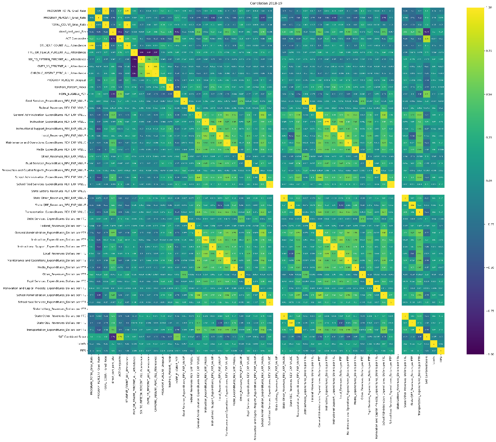
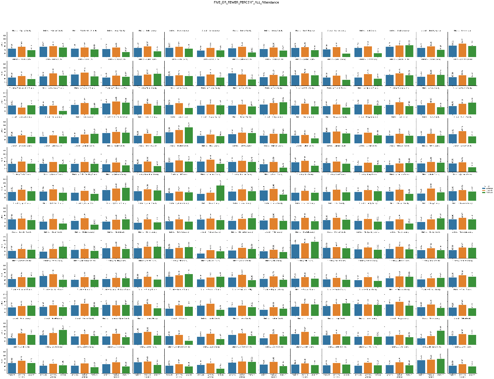

**Georgia School Categorization through Covid**

Data downloaded from <https://gosa.georgia.gov/dashboards-data-report-card/downloadable-data> and aggregated/organized with python and manually. Missing data was filled in with the annual category mean or with zeros as appropriate. Revenue and expenditures data was normalized by the district student count.

json for Georgia cities downloaded from <https://github.com/deldersveld/topojson>

Requirements

python version 3.9.7

pandas version 1.3.4

numpy version 1.20.3

sckikit-learn version 1.2.1

matplotlib version 3.4.3

seaborn version 0.11.2

yellowbrick version 1.5

plotly version 5.13.1

descartes-1.1.0

python-kaleido version 0.2.1

geopandas version 0.12.2

Several revenue values are correlated and may be dropped if modeling is to be done. Cluster labeling simply categorizes like school systems.

**Overall county cluster labeling**

The elbow was selected at 18 clusters for each school year. 10 could possibly have been chosen but there’s little difference in algorithm performance.

2018-19

2019-20

2020-21

**County Systems**

The differences between counties were centered on primarily metro county areas in 2018-19 and decreased in 2019-20 which included the start of the pandemic. In 2020-21 as schools reopened changes increased primarily in southern Georgia.

**City Systems**

2018-19

2019-20

2020-21

In 2020-21, city categorizations became more homogenous.

**SAT Combined Score**

The differences between counties were centered on primarily metro county areas in 2018-19 and decreased in 2019-20 which included the start of the pandemic. In 2020-21 as schools reopened changes increased primarily in southern Georgia.

**County Systems**

**City Systems**

2018-19

2019-20

After 2018-19, city SAT combined scores became more homogenous – specifically increasing in many systems.

2020-21

**Changes over the years per system**

Overall Bar Charts of the categories used that show changes over the 3 years of data used. These plots may also be viewed in larger form at <https://github.com/tmsuidan/GaEduData2018-21/tree/main/images/bar>

Linear regression equations and r2 values are available here:

<https://github.com/tmsuidan/GaEduData2018-21/tree/main/images/rates>

